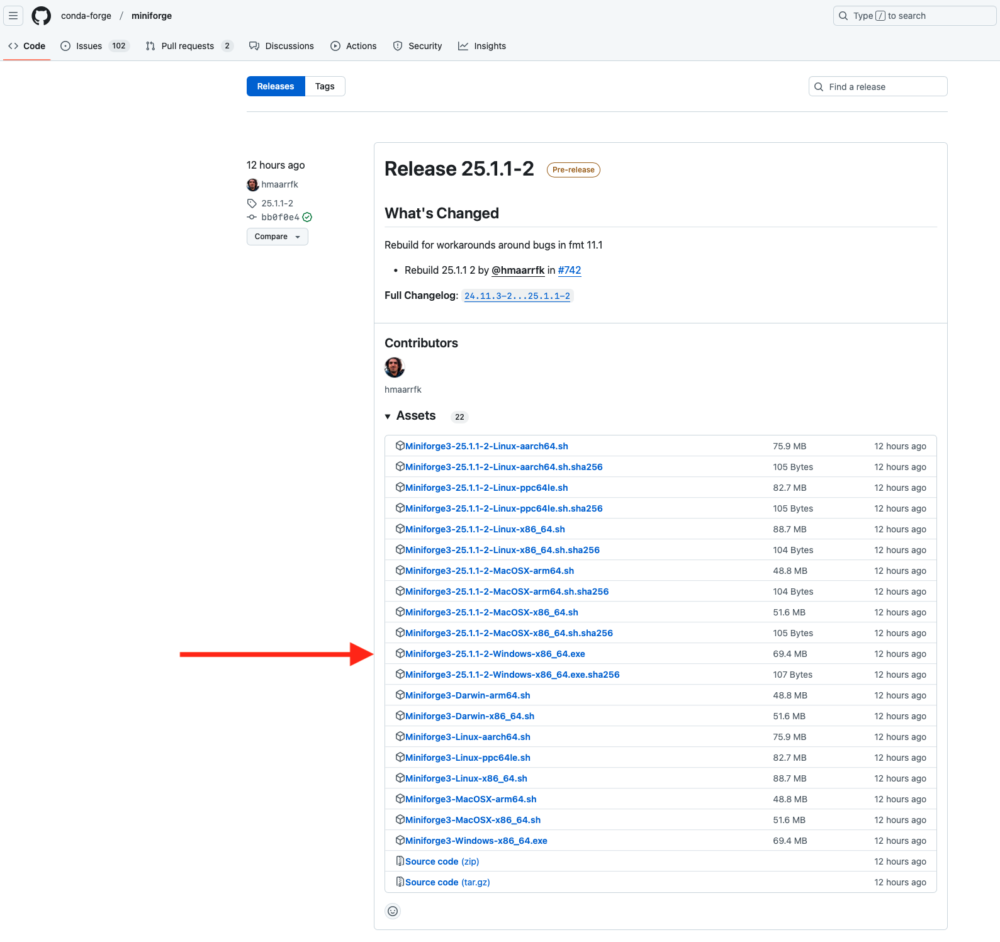
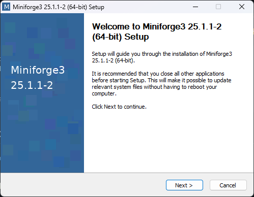
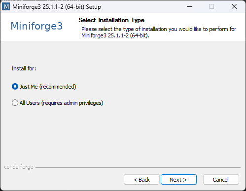
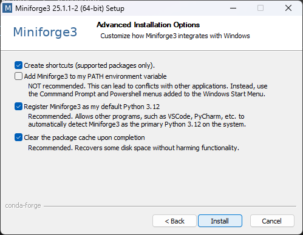
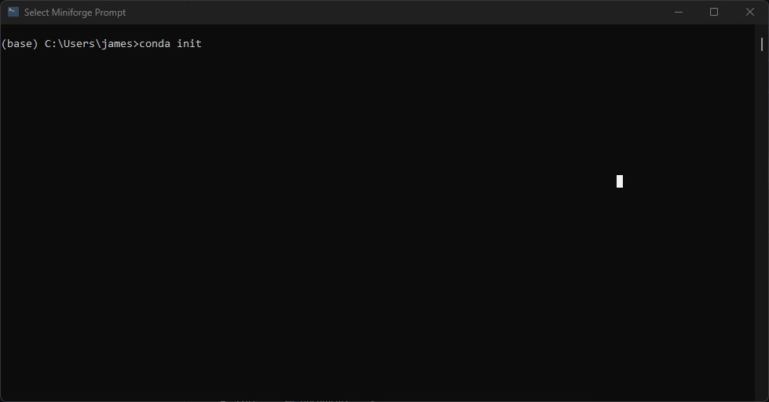
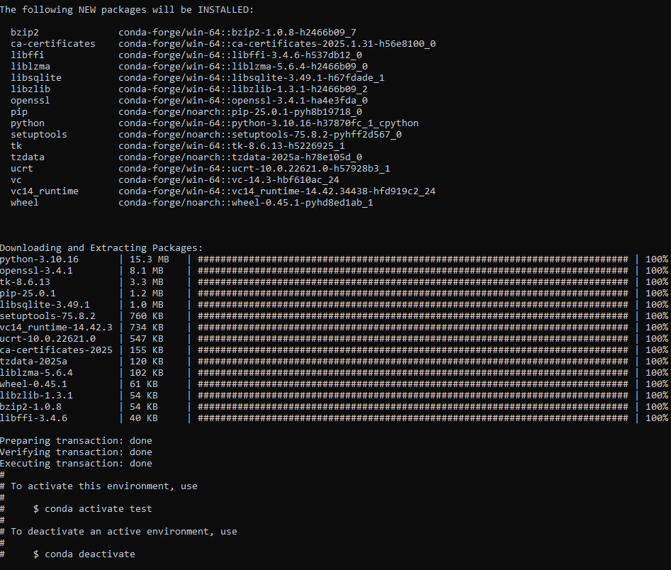
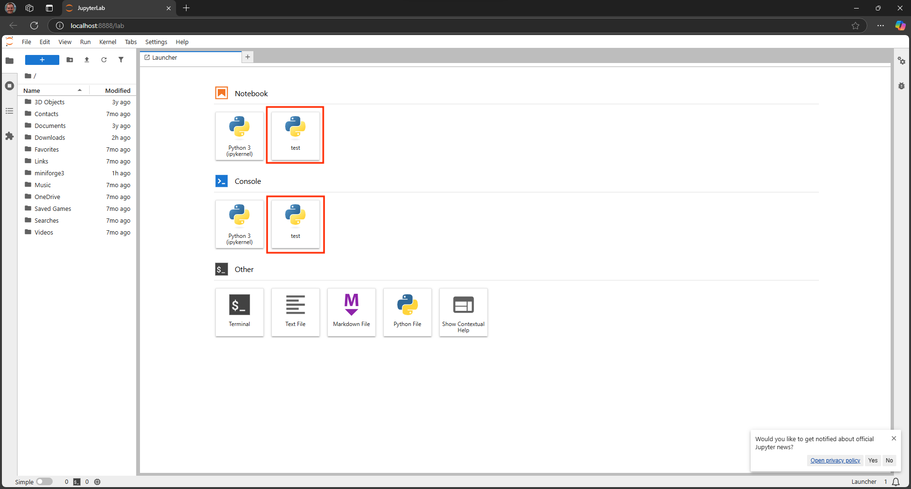

# Python in 30mins

A QuickStart guide to using Python for data science in 30 minutes!

If you want to code along on the day, **in advance of the session** please install `conda`. Instructions are below, it _really_ should take <5 mins. You're successful if you've completed Step 2 😊. If you have questions please email me.

This is a primer aimed to get people new to programming off the ground. If you are experienced it will be a bit dull for you!

**What is `conda`?**

`conda` is a package and environment manager that allows you to install Python and associated packages in isolated environments on your computer. This means you can have different versions of Python and libraries working side by side without interference. Using isolated environments is a best practice that enhances reproducibility.

While `conda` is open source and free to use, it was originally developed as part of the Anaconda suite. However, Anaconda includes many packages that you might not need and, in some cases, may lead to costs (especially in certain academic or enterprise settings). **Miniforge** is a lightweight installer for `conda` that intentionally avoids channels which might incur costs.

**But I am an `R` person...**

We forgive you. This session is just aimed at demystifying coding and for brevity we focus on one language: python. Also `conda` works well for isolating `R` environments.


## Step 1: Install `conda`
---

### Windows

1. **Download the Installer:**
   - Go to the [Miniforge GitHub releases page](https://github.com/conda-forge/miniforge/releases).
   - Download the latest Windows installer. These are frequently updated. Look for a file similar to `Miniforge3-...-Windows-x86_64`. You may need to click on a triangle **Assests** toggle to see the latest releases (see screenshot).

   <details>
     <summary>Screenshot of Download Page</summary>
     
   </details>

2. **Run the Installer:**
   - Double-click the downloaded `.exe` file.
   - Follow the installation prompts. You can typically accept the default settings.
   - See screenshots for suggested settings.
  
  <details>
    <summary>Show Windows MiniForge Installer Screenshots</summary>
    
    <br>
    
    <br>
    
  </details>

3. **Initialise `conda`:**
   - In the Windows Start menu search for **Miniforge Prompt**.
   - When Miniforge Prompt has opened, type `conda init` and hit return (see screenshot).
   - After it runs exit Miniforge Prompt to cofirm changes.
   - `conda` has now been initialsed and `conda` commands should work in the Miniforge Prompt application as well as other terminal applications such as Command Prompt (installed on Windows machines by default)

   <details>
     <summary>Screenshot `conda` intialisation</summary>
     
   </details>

---

### macOS

1. **Download the Installer:**
   - Open the **Terminal** application (comes installed on all macs).
   - Copy/Paste the following code and hit return. This downloads the latest installer for your mac (and intelligently chooses the Mac Silicon or Intel installer)
     ```bash
     curl -L -O "https://github.com/conda-forge/miniforge/releases/latest/download/Miniforge3-$(uname)-$(uname -m).sh"
     ```

2. **Run the Installer:**
   - Now that the installer has downloaded, copy/paste the following and hit return. This executes the installer.
     ```bash
     bash Miniforge3-$(uname)-$(uname -m).sh
     ```
   - Follow the on-screen instructions to complete the installation.

---

## Step 2: Creating a test `conda` environment

After installing `conda`, verify that you can create a new environment. 

 - Open your terminal application (e.g. Windows: Command Prompt, or macOS:Terminal).
 - Create your first conda environment by typing in the code below and hitting return.
 - If you got to this stage then you can code along on the day 🙌
 
 ```bash
 conda create --name test python=3.10 -y # the -y flag answers 'yes' to questions during environment creation 
 ```
 - You should see it spring into action and install a bunch of stuff.
 - This has created an environment called `test` that has its own version of Python (v3.10) installed in it.
 - If successful it will conclude by suggesting you activate the environment (see screenshot).
 <details>
  <summary>Screenshot `conda` test enviroment creation</summary>
  
 </details>
 - Now that you have created the environment you need to activate it, run:
 
 ```bash
 conda activate test
 ```
 
 - You should notice the command line now begins `(test)`, this indicates the environment is activated.
 - Now we need to install some python software packages, we do this with `pip` the Python package manager:
 
 ```bash
 pip install jupyterlab pandas numpy
 ```
 
 - Now we need to 'register' the kernel (this makes it accessible to jupyter lab)
 
 ```bash
 python -m ipykernel install --user --name test
 ```
 
 - Finally, we will start a jupyter lab session (we will explain what this is)
 
 ```bash
 jupyter lab
 ```
 
 - This should open your browser to a page that looks like the screenshot below. Note the Python icons with `test` written in them (I've highlighted them in red boxes).
 <details>
  <summary>Screenshot Jupyter Lab</summary>
  
 </details>
 
 **If you do not see jupyter lab with these icons then something has gone wrong. Please contact me in advance** since we won't have time to troublehsoot installation on the day...
