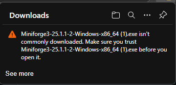
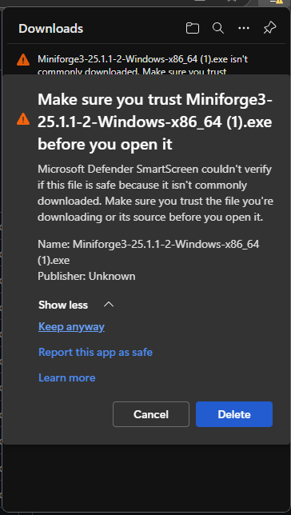
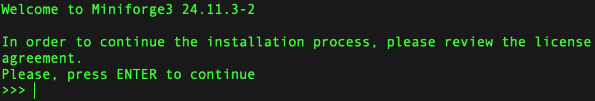
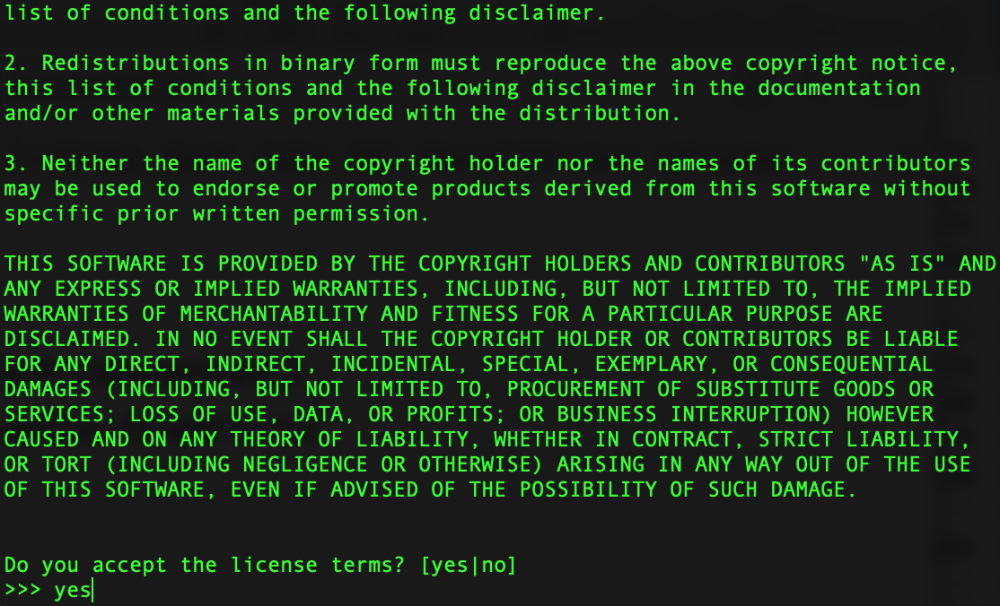
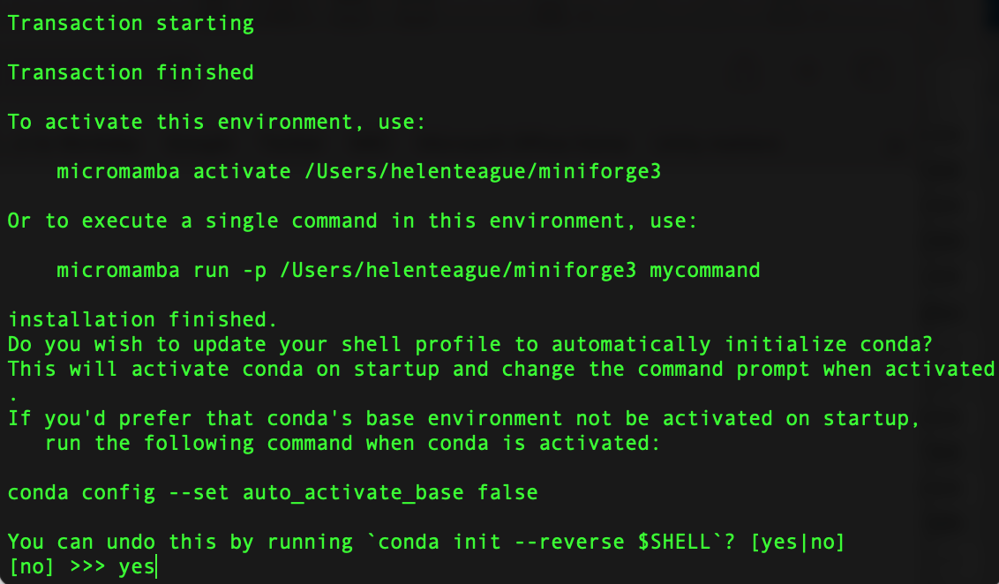
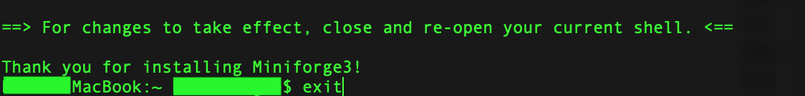

# Python in 30mins
---

*Last Updated: 2025-03-13*  
*Contact: [james.cranley@doctors.org.uk](mailto:james.cranley@doctors.org.uk)*

This will be a 'quick start' guide to using Python for data science in 30 minutes!

If you want to code along on the day please install `conda` on your own laptop **in advance of the session**.

Instructions to install `conda` (for Windows and Mac) are below, it should take <5 mins. You're successful if you've completed Step 2 😊. If you have questions please email me.

‼️ If you are using a 'work laptop' you may be blocked from installing new software, so use your own laptop if you have one.

Note: This is a primer aimed to get people new to programming off the ground. If you are experienced it will be a bit dull for you!

You can skip to Step 1 now. If you are interested, there is some info below on what `conda` actually is.

<details>
  <summary>What is `conda`?</summary>

  [**`conda`**](https://docs.conda.io/projects/conda/en/latest/user-guide/getting-started.html) is a package and environment manager that allows you to install Python and associated packages in isolated environments on your computer. This means you can have different versions of Python and libraries working side by side without interference. Using isolated environments is a best practice that enhances reproducibility.

  While `conda` is open source and free to use, it was originally developed as part of the Anaconda suite. However, Anaconda includes many packages that you might not need and, in some cases, may lead to costs (especially in certain academic or enterprise settings). [**`Miniforge`**](https://github.com/conda-forge/miniforge) is a lightweight, open-source installer for `conda` that intentionally avoids channels which might incur costs.

</details>


## Step 1: Install `conda`
---

### **Windows**

1. **Download the Installer:**
   - Installers are frequently updated. As of March 2025, you can download the latest Windows installer [HERE](https://github.com/conda-forge/miniforge/releases/download/25.1.1-2/Miniforge3-25.1.1-2-Windows-x86_64.exe)
   - Future versions can be downloaded from the Miniforge GitHub Releases page
   - Windows may say it doesn't trust the file. You can force it to 'keep anyway'.
  
     <details>
       <summary>Screenshot: Ask Windows to 'trust' the download</summary>
       
       <br>
       
     </details>

3. **Run the Installer:**
   - Double-click the downloaded `.exe` file.
   - If you have a work laptop it may block you from installing it at this point.
   - Follow the installation prompts. You can typically accept the default settings.
   - See screenshots for suggested settings.
  
     <details>
       <summary>Show Windows MiniForge Installer Screenshots</summary>
       
       <br>
       
       <br>
       
     </details>

4. **Initialise `conda`:**
   - In the Windows Start menu search for **Miniforge Prompt**.
   - When Miniforge Prompt has opened, type `conda init` and press `return` (see screenshot).
   - After it runs exit Miniforge Prompt to confirm changes.
   - `conda` has now been initialised and `conda` commands should work in the Miniforge Prompt application as well as other terminal applications such as Command Prompt (installed on Windows machines by default)

      <details>
        <summary>Screenshot `conda` intialisation</summary>
        
      </details>

---

### **macOS**

1. **Download the Installer:**
   - Open the **Terminal** application (comes installed on all macs). You can search for 'Terminal' using spotlight (cmd+space).
   - Copy/Paste the following code and press return. This downloads the latest installer for your mac (and intelligently chooses the Mac Silicon or Intel installer)
     ```bash
     curl -L -O "https://github.com/conda-forge/miniforge/releases/latest/download/Miniforge3-$(uname)-$(uname -m).sh"
     ```

2. **Run the Installer:**
   - Now that the installer has downloaded, copy/paste the following and press return. This executes the installer.
     ```bash
     bash Miniforge3-$(uname)-$(uname -m).sh
     ```
   - Follow the on-screen instructions to complete the installation:
      1. Press `return` to start reviewing the licence. Then press the down arrow ⬇️ on your keyboard to go through the licence. It will eventually ask you to enter yes/no, type `yes` and press `return` to accept the terms (see screenshots).
  
         <details>
           <summary>Screenshots: review conda licence</summary>
           
           <br>
           
         </details>

      2. Press `return` to accept the default location (`/Users/<yourusername>/miniforge3`)
      3. It will then install (takes about 1 min).
      4. ‼️ After installing it gives you a confusing screen (see screenshot). The question is `Do you wish to update your shell profile...?`. Type **`yes`** and press `return`.
  
         <details>
           <summary>Screenshot: Update shell profile</summary>
           
         </details>

      5. It will chug along for another minute and then conclude by saying:
    
         ```bash
         ==> For changes to take effect, close and re-open your current shell. <==
         ```
         You can either quit the Terminal (`cmd`+`q`) or type `exit` then press `return`.
         
         <details>
           <summary>Screenshot: Complete installation</summary>
           
         </details>

---

## Step 2: Creating a test `conda` environment

After installing `conda`, verify that you can create a new environment. 

 - Open your terminal application (e.g. Windows: Command Prompt, or macOS: Terminal).
 - Copy/Paste the code below into the terminal and press `return`. NB This will take a few minutes.
 
 ```bash
 conda create --name test python=3.10 -y # the -y flag answers 'yes' to questions during environment creation 
 ```
 
 - You should see it spring into action and install a bunch of stuff.
 - This has created an environment called `test` that has its own version of Python (v3.10) installed in it.
 - If successful, it will conclude by suggesting you activate the environment (see screenshot).
    
    <details>
     <summary>Screenshot `conda` test environment creation</summary>
     
    </details>
 
 - As it suggests, you should activate the environment. Copy/Paste the code below and press `return`:
 
 ```bash
 conda activate test
 ```

 - You should notice the command line now begins `(test)`, this indicates the `test` environment is activated.
 - We now need to install some Python software packages (at present all we have is python itself). To do this with `pip` the Python package manager. Copy/paste the code below and press `return` (NB this may take 2 mins and it pauses at the end, **wait until you have a flashing cursor again before continuing**):
 
 ```bash
 pip install jupyterlab pandas numpy
 ```
 
 - Now we need to 'register' the kernel (this makes it accessible to jupyter lab). Copy/paste the code below and press `return`:
 
 ```bash
 python -m ipykernel install --user --name test
 ```
 
 - Finally, we will start a jupyter lab session (we will explain what jupyter lab is later). Copy/paste the code below and press `return`:
 
 ```bash
 jupyter lab
 ```
 
 - This should open your web browser to a page that looks like the screenshot below. Note the Python icons with `test` written in them (I've highlighted them in red boxes).
 
    <details>
     <summary>Screenshot Jupyter Lab</summary>
     
    </details>
    
 **If you do not see jupyter lab with these icons then something has gone wrong. Please contact me in advance** since we won't have time to troubleshoot installation on the day...
