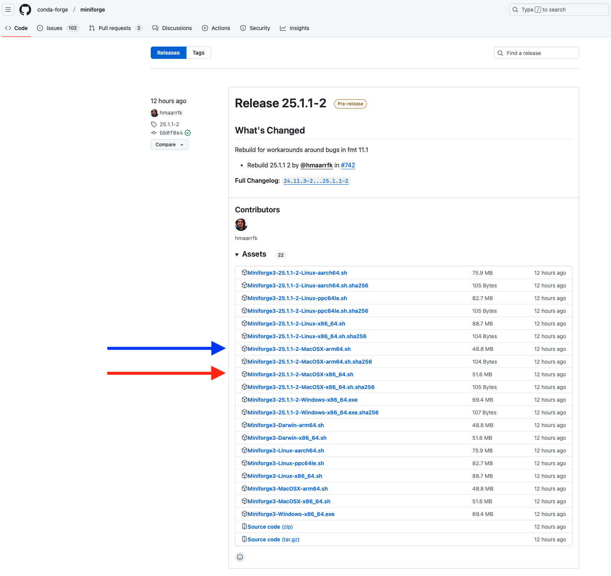

# Python in 30mins  
Quickstart guide to using Python for data science in 30 minutes!

## Step 1: Install `conda`

### What is `conda`?

`conda` is a package and environment manager that allows you to install Python and associated packages in isolated environments on your computer. This means you can have different versions of Python and libraries working side by side without interference. Using isolated environments is a best practice that enhances reproducibility (see [FAIR principles](https://en.wikipedia.org/wiki/FAIR_data)).

While `conda` is open source and free to use, it was originally developed as part of the Anaconda suite. However, Anaconda includes many packages that you might not need and, in some cases, may lead to costs (especially in certain academic or enterprise settings). **Miniforge** is a lightweight installer for `conda` that intentionally avoids channels which might incur costs.

---

### Windows

1. **Download the Installer:**
   - Go to the [Miniforge GitHub releases page](https://github.com/conda-forge/miniforge/releases).
   - Download the latest Windows installer. These are frequently updated. Look for a file similar to `Miniforge3-...-Windows-x86_64`. You may need to click on a triangle **Assests** toggle to see the latest releases (see screenshot).

   <details>
     <summary>Screenshot of Download Page</summary>
     
   </details>

2. **Run the Installer:**
   - Double-click the downloaded `.exe` file.
   - Follow the installation prompts. You can typically accept the default settings.
   - See screenshots for suggested settings.
  
  <details>
    <summary>Show Windows MiniForge Installer Screenshots</summary>
    
    <br>
    
    <br>
    
  </details>

3. **Initialise `conda`:**
   - In the Windows Start menu search for **Miniforge Prompt**.
   - When Miniforge Prompt has opened, type `conda init` and hit return (see screenshot).
   - After it runs Exit Miniforge prompt and restart it.
   - Conda should now be initialsed and conda commands should work in the Miniforge Prompt application as well as other commmand line applications such as Command Prompt (installed on Windows machines by default)

   <details>
     <summary>Screenshot `conda` intialisation</summary>
     
   </details>

 4. **Make a test environment:**
    - Open a terminal applciation (e.g. Start >> Command Prompt) and create your first conda environment.
    ```bash
    conda create --name test python=3.10 -y # the -y flag answers 'yes' to questions during environment creation 
    ```
    - You should see it spring into action and isntall a bunch of stuff. If successful it will conclude by suggesting you activate the environment.

    <details>
     <summary>Screenshot `conda` test enviroment creation</summary>
     
    </details>

---

### macOS

1. **Download the Installer:**
   - Visit the [Miniforge GitHub releases page](https://github.com/conda-forge/miniforge/releases).
   - Download the installer for your Mac:
     - **Intel-based Macs:** Download `Miniforge3-...-MacOSX-x86_64.sh` (red arrow in screenshot)
     - **Apple Silicon (M1/M2/M3/M4):** Download `Miniforge3-...-MacOSX-arm64.sh` (blue arrow in screenshot)

     <details>
     <summary>Screenshot of Download Page</summary>
     
     </details>

2. **Run the Installer:**
   - Open the **Terminal** application.
   - Navigate to your Downloads folder (or the folder where the installer is located):
     ```bash
     cd ~/Downloads
     ```
   - Run the installer script (replace `<installer-file>` with the actual file name):
     ```bash
     bash <installer-file>
     ```
   - Follow the on-screen instructions to complete the installation.

3. **Verify the Installation:**
   - Open a new Terminal window and run:
     ```bash
     conda --version
     ```
   - The conda version should appear, confirming that the installation was successful.

---

## Step 2: Creating a test conda Environment

After installing `conda`, verify that you can create a new environment. Open your terminal (Command Prompt, PowerShell, or macOS Terminal) and run:

```bash
conda create --name test python=3.10 -y
```
